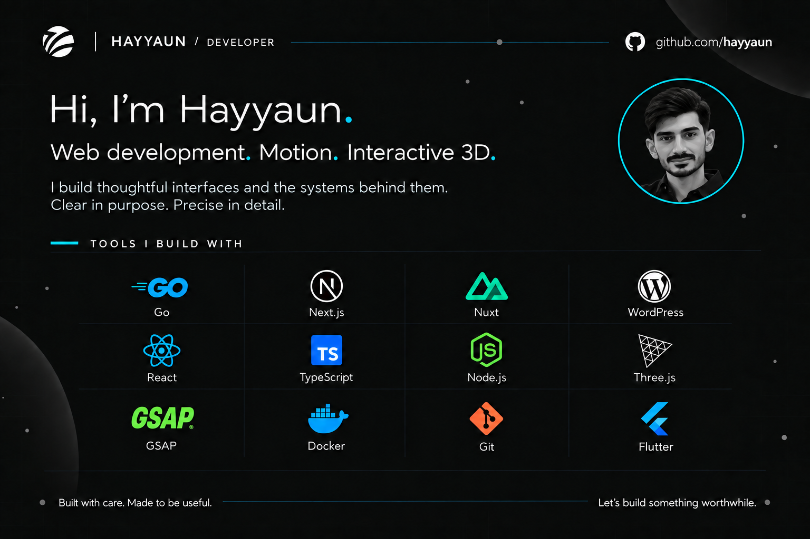

# Hi, I’m Hayyaun.

I build web interfaces with an eye for detail, purposeful motion, and interactive 3D. I care about how a website feels—and how well it works for the people using it.

**Thoughtful code. Meaningful experiences.**

## What I work with

- **Interfaces:** React, Next.js, Nuxt, TypeScript, Tailwind CSS, and WordPress.
- **Backend & tooling:** Go, Node.js, Docker, and Git.
- **Mobile:** Flutter.
- **Interactive 3D:** Three.js, React Three Fiber, and GLSL.
- **Motion:** GSAP and carefully considered interactions.
- **Engineering:** accessibility, performance, architecture, and code review.

## My approach

Make the content clear. Give the details character. Let motion and depth earn their place.

I start with useful, accessible interfaces and add the touches that make them memorable. The best work brings design and engineering together.

## Let’s connect

Have an idea worth building? [Start a conversation with me on GitHub](https://github.com/hayyaun).

---

This repository also contains my portfolio, built with Next.js, TypeScript, Tailwind CSS, and React Three Fiber. To run it locally: `npm install`, then `npm run dev`. Check it with `npm run lint` and `npm run build`.
